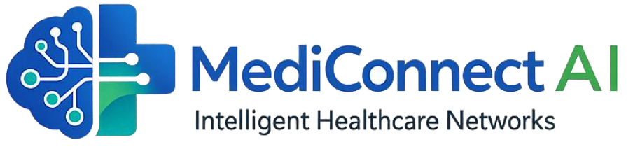

# MediConnect AI

<p align="center">
  
</p>


**Système d'Optimisation Intelligente pour les Réseaux des Hôpitaux**  
Mini Projet - 4ème Année GTR  
École Nationale des Sciences Appliquées de Safi (ENSAS)

---

## 🛠️ Stack Technique

<p align="center">
  
  
  
  
  
  
</p>

## 📋 Description

MediConnect AI est un système innovant d'optimisation des réseaux hospitaliers combinant l'**Intelligence Artificielle prédictive** (LSTM/GRU) avec les **Réseaux Définis par Logiciel (SDN)**. Le système prédit les flux patients et reconfigure dynamiquement le réseau pour garantir la qualité de service des équipements médicaux critiques.

### Architecture à deux niveaux

- **Niveau 1 - Cœur Prédictif (IA)** : Modèles LSTM/GRU entraînés sur 10 ans de données NHS (60 000+ enregistrements) pour prédire les flux patients par type de département.
- **Niveau 2 - Système d'Exécution (SDN)** : Contrôleur OpenDaylight qui déploie automatiquement des règles OpenFlow pour prioriser le trafic médical critique.

---

## ✨ Fonctionnalités

- **Prédiction IA** : Prédiction des flux patients pour 3 types de départements (Major A&E, Specialty, Minor Injuries)
- **Reconfiguration SDN** : Déploiement automatique de règles OpenFlow via API RESTCONF
- **Tableau de Bord Interactif** : Interface Flask + D3.js pour supervision en temps réel
- **Topologie Dynamique** : Simulation Mininet avec contrôleur distant OpenDaylight
- **Historique des Reconfigurations** : Journal des actions réseau automatiques

---

## 🚀 Installation

### Prérequis

- Python 3.8+
- Java 23 (pour OpenDaylight Karaf)
- Ubuntu/Linux (pour Mininet)
- Git

### Étape 1 : Cloner le dépôt

```bash
git clone <repository-url>
cd MediConnect-Ai
```

### Étape 2 : Environnement Python

```bash
python3 -m venv venv
source venv/bin/activate
pip install -r requirements.txt
```

### Étape 3 : Installation SDN

Voir le guide détaillé dans `startup guide.txt` ou l'annexe du rapport.

```bash
# Java 23
sudo apt-get install openjdk-23-jdk -y

# Mininet
sudo apt-get install mininet -y

# OpenDaylight
wget https://nexus.opendaylight.org/content/repositories/opendaylight.release/org/opendaylight/integration/karaf/0.12.3/karaf-0.12.3.tar.gz
tar -xvzf karaf-0.12.3.tar.gz
```

---

## 🎮 Utilisation

### Séquence de démarrage

Ouvrez 3 terminaux :

**Terminal 1 - OpenDaylight (Contrôleur SDN)**
```bash
cd /odl-carbon/bin
./karaf
# Dans Karaf : feature:install odl-restconf odl-l2switch-switch odl-openflowplugin-all-li odl-dlux-core
```

**Terminal 2 - Mininet (Réseau simulé)**
```bash
sudo mn --controller=remote,ip=127.0.0.1,port=6633 --switch=ovsk,protocols=OpenFlow13 --topo=single,4 --mac
mininet> pingall
```

**Terminal 3 - Dashboard (Interface Web)**
```bash
cd ~/MediConnect_Project
source venv/bin/activate
python3 dashboard.py
```

Ouvrez votre navigateur sur `http://localhost:5000`

### Vérification

```bash
# Vérifier l'API RESTCONF
curl -u admin:admin http://localhost:8181/rests/data/opendaylight-inventory:nodes

# Vérifier les règles OpenFlow dans Mininet
sh ovs-ofctl -O OpenFlow13 dump-flows s1
```

---

## 📁 Structure du Projet

```
MediConnect-Ai/
├── dashboard.py              # Application Flask + API IA-SDN
├── Ai_model.ipynb            # Notebook d'entraînement LSTM/GRU
├── seasonal_profiles.pkl     # Profils saisonniers précalculés
├── mediconnect_final_model.h5 # Modèle IA entraîné
├── mediconnect_final_scaler.pkl # Scaler pour les données
├── startup guide.txt         # Guide de démarrage rapide
├── rapport.tex               # Rapport de projet (LaTeX)
├── Screenshots/              # Captures d'écran
│   ├── logo4.png
│   ├── Dashboard start.png
│   ├── opendaylight topology 4.png
│   ├── pingall result.png
│   └── ...
└── README.md                 # Ce fichier
```

---

## 🧠 Modèle IA

- **Architecture** : LSTM (128 → 64) + Batch Normalization + Dropout (0.2)
- **Entrée** : Séquence de 12 pas temporaux avec profils saisonniers réels
- **Sortie** : 3 valeurs (Type 1, Type 2, Type 3 attendances)
- **Performance** : $R^2 \approx 0,87$, MAE $\approx 491$ patients
- **Entraînement** : 50 époches, batch size 64, ReduceLROnPlateau

---

## 📊 Tableau de Bord

Le tableau de bord offre :

- **Vue des prédictions** : Graphiques D3.js des flux patients réels vs prédits
- **Topologie SDN** : Visualisation du réseau Mininet en temps réel
- **Contrôles manuels** : Override des priorités de ports
- **Historique** : Tableau des reconfigurations automatiques
- **Indicateurs de santé** : Statut de connexion IA et ODL

---

## 🖼️ Screenshots

### Architecture Globale
> **Note** : *L'image de l'architecture est en cours de conception (actuellement sous forme d'espace réservé TikZ dans le rapport LaTeX).*

### Tableau de Bord


### Topologie Mininet (Pingall Test)


### OpenDaylight


---

## 🔧 Configuration

### Variables dans `dashboard.py`

```python
ODL_BASE = "http://127.0.0.1:8181"
FLOW_NODE = "openflow:1"
FLOW_TABLE = 0
FLOW_ID = "1"
FLOW_PRIORITY = 65000
```

### Port Dashboard
Par défaut : `5000`  
Modifiable : `app.run(host='0.0.0.0', port=5000)`

---

## 📚 Documentation

- **Rapport de projet** : `rapport.tex` (LaTeX)
- **Guide de démarrage** : `startup guide.txt`
- **Notebook IA** : `Ai_model.ipynb`

---

## 👥 Équipe

<div align="center">
  <table>
    <tr>
      <td align="center"><a href="https://github.com/MohammedReqasse"><br /><b>Mohammed Reqasse</b></a></td>
      <td align="center"><a href="https://github.com/SouhaylRamdani"><br /><b>Souhayl Ramdani</b></a></td>
      <td align="center"><a href="https://github.com/IbrahimLaamech"><br /><b>Ibrahim Laamech</b></a></td>
    </tr>
  </table>
</div>

- **Encadrante** : Mme. Mestouri
- **Filière** : Génie Télécommunications et Réseaux (GTR)
- **Année** : 4ème année
- **Établissement** : ENSAS - Université Cadi Ayyad

---

## 📄 Licence

Ce projet est réalisé dans le cadre académique du Mini Projet 4ème année GTR à l'ENSAS.

---

## 🤝 Contribuer

Pour toute question ou suggestion, contactez l'équipe projet ou l'encadrante pédagogique.

---

**MediConnect AI - Optimisation Intelligente des Réseaux Hospitaliers**
